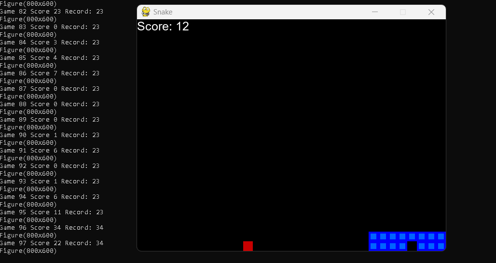
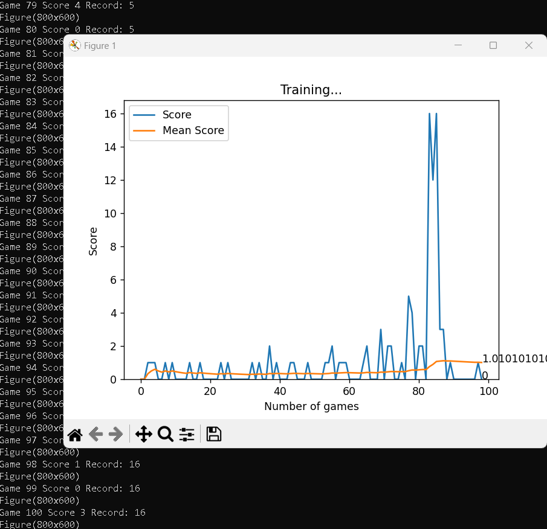
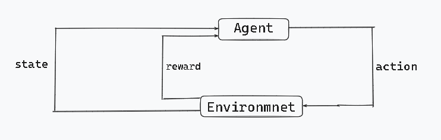
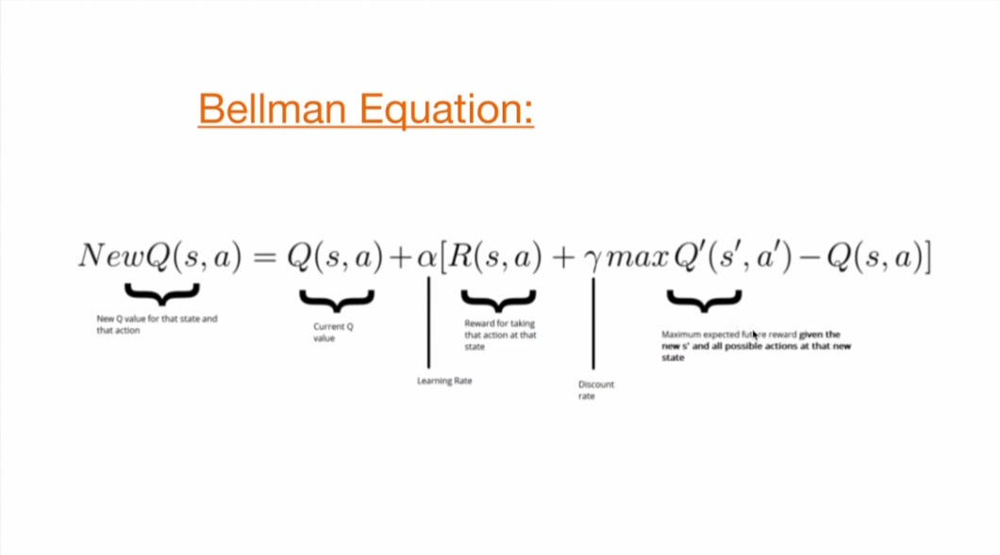

# SnakeAI-PyTorch

This repository contains a reinforcement learning project that trains an AI agent to play the classic Snake game autonomously. Using Python, PyTorch, and Pygame, this project demonstrates how reinforcement learning techniques can be applied to train an AI agent to make real-time decisions and improve its gameplay.

## Project Overview

In this project, we use Deep Q-Learning (DQN), a popular reinforcement learning algorithm, to teach the AI agent to play Snake. The goal of the agent is to learn optimal strategies to grow as long as possible without colliding with the game boundaries or its own body.

The training process visualizes the agent's progress in two ways:
1. **Real-time Game Window**: Shows the current state of the game as the AI learns.
2. **Score Plot**: Displays the score and average score trend over the number of games, allowing you to track the agent’s performance improvement.

### Real-time Game Window

### Score Plot

## Features

- **Game Environment**: Implemented using Pygame to simulate the classic Snake game.
- **Reinforcement Learning Algorithm**: Uses Deep Q-Learning with experience replay to optimize the agent's performance.
- **Model Training**: The model is trained using PyTorch, leveraging GPU acceleration when available.
- **Dynamic Visualization**: Real-time visualization of the Snake game and agent’s decision-making process.

## Technologies Used

- **Python**: Main programming language used for the project.
- **PyTorch**: Deep learning framework to build and train the DQN model.
- **Pygame**: Library used for game development and visualization.
- **Matplotlib**: Library used for score and mean visualization.

## Reinforcement Learning Overview

In reinforcement learning (RL), an agent learns to interact with an environment in order to maximize cumulative rewards. The agent observes the current **state** of the environment, takes an **action**, and receives a **reward** and the next **state** as feedback. The process continues until a terminal **end** state is reached.

Below is a simple diagram showing the interaction loop in reinforcement learning:

### Key Concepts in Reinforcement Learning

- **Agent**: The learner or decision maker that interacts with the environment. Takes action.
- **State**: The current situation or configuration of the environment that the agent observes.
- **Action**: A decision made by the agent based on the current state, which affects the environment.
- **Reward**: The feedback signal that the agent receives after taking an action, indicating the desirability of that action.
- **Environment**: The agent interacts with environment. The environment updates it's status according to Agent's actions.

## Bellman Equation in Deep Q-Learning

The Bellman Equation is fundamental in reinforcement learning and Q-Learning algorithms. It helps the agent to update the Q-values, which are estimates of the expected future rewards. The Q-value is updated using the Bellman Equation, as shown below:

In this equation:
- **NewQ(s, a)**: The updated Q-value for the current state `s` and action `a`.
- **Q(s, a)**: The existing Q-value for the current state `s` and action `a`.
- **α (Learning Rate)**: Determines how much new information overrides old information.
- **R(s, a)**: The immediate reward received after taking action `a` in state `s`.
- **γ (Discount Rate)**: Determines the importance of future rewards compared to immediate rewards.
- **max Q'(s', a')**: The maximum predicted Q-value for the next state `s'` and all possible actions `a'`.

The Bellman Equation helps the agent learn optimal actions by balancing immediate rewards with expected future rewards.
